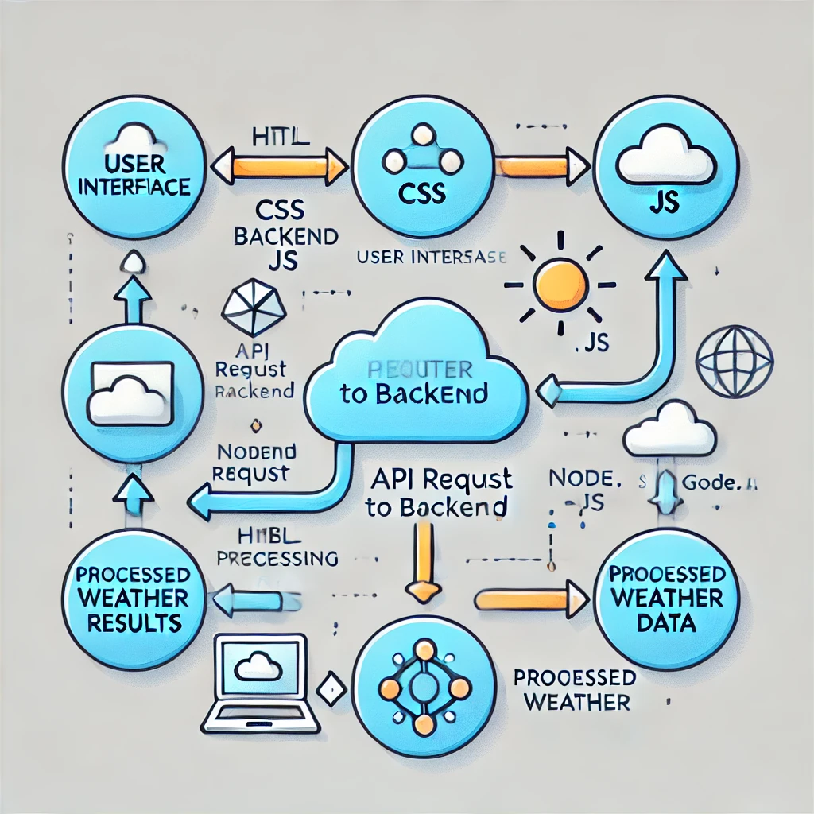

# Weather App

This is a simple weather app built using HTML, CSS, and JavaScript, utilizing the Google Weather API.

## Flowchart Preview

Below is the flowchart preview of the Weather App architecture:

## Features
- Search for weather by location.
- Real-time weather updates.
- Simple and clean user interface.

## Technologies Used
- HTML, CSS, JavaScript
- Google Weather API

## How to Use
1. Clone the repository.
2. Open `index.html` in a browser to run the app.

---

